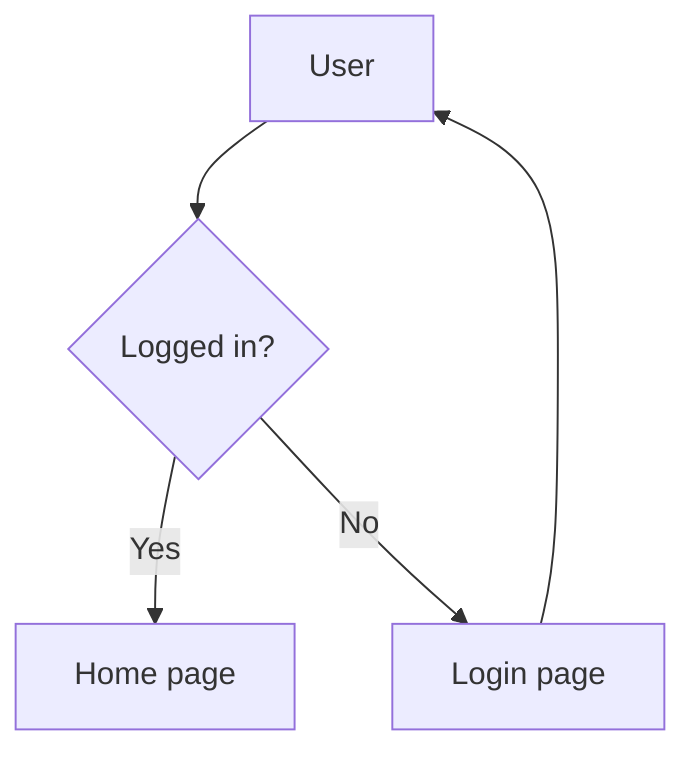

# AnyMermaid

<p align="center">
    <a href="https://skillhub.cn/skills/anymermaid-skill" target="_blank"></a>
    <a href="https://www.modelscope.cn/skills/anyforge/anymermaid-skill" target="_blank"></a>
</p>

<p align="center">
  <a href="README.md">English</a> | <a href="README_zh.md">简体中文</a>
</p>

**A Mermaid diagramming skill pack designed for AI agents** — full syntax reference for 26 official diagram types, cross-platform command templates, plus battle-tested notes on puppeteer sandboxing, headless environments, stdin rendering, and dry-run validation.

Works with Claude Code, OpenCode, Cursor, and any agent runtime that follows the `SKILL.md` convention. Also usable as a plain reference manual for Mermaid syntax and the `mmdc` CLI.

---

## Features

- ✅ **26 diagram types covered** — from everyday flowcharts and sequence diagrams to specialized C4, sankey, radar, Wardley maps, and event-modeling diagrams, each with a minimal copy-paste-ready example.
- ✅ **Cross-platform commands** — macOS / Linux / Windows PowerShell / cmd variants provided everywhere. No more "Windows users stare blankly at heredocs".
- ✅ **Fixes multiple syntax pitfalls** — all 8 sequence-diagram arrow styles listed, class/ER relation tables rendered as code blocks (avoiding markdown pipe collisions), and mindmap `root` syntax clarified.
- ✅ **Auto-degrades in headless** — SSH / CI / Docker environments skip "open the file" and just print the absolute path.
- ✅ **Sensible defaults hardcoded** — every render command bakes in `-w 1600 -s 3` so you don't get blurry output or squashed layouts.
- ✅ **Practical troubleshooting table** — 10+ common issues indexed: puppeteer sandbox, missing fonts, PowerShell execution policy, stale PATH, and more.

---

## Quick start

### Prerequisites

Node.js ≥ 18 and Mermaid CLI:

```bash
# Works on all three platforms
npm install -g @mermaid-js/mermaid-cli
```

Zero-install one-shot (downloads on each run):

```bash
npx  -p @mermaid-js/mermaid-cli mmdc -i diagram.mmd -o diagram.svg
pnpm dlx @mermaid-js/mermaid-cli mmdc -i diagram.mmd -o diagram.svg
bunx @mermaid-js/mermaid-cli mmdc -i diagram.mmd -o diagram.svg
```

### As an AI agent skill

Drop the whole `anymermaid-skill` directory into your agent's skill-loading path, restart the agent, then just say:

> Draw a sequence diagram for user login.

The agent will match this skill automatically, follow the workflow in `SKILL.md`, look up the relevant chapter in `anymermaid-skill/references/syntax.md`, write the `.mmd` file, invoke `mmdc`, and return the absolute path to the rendered image.

### As a reference manual

No agent needed:

- **Commands & workflow** → [`SKILL.md`](./skills/anymermaid-skill/SKILL.md)
- **Full syntax for 26 diagram types** → [`references/syntax.md`](./skills/anymermaid-skill/references/syntax.md)

---

## Directory layout

```
anymermaid/
├── SKILL.md           # main definition: workflow, commands, params, troubleshooting
└── references/
    └── syntax.md      # 26 diagram-type syntax reference (774 lines)
```

---

## Diagram types covered

| Common (12) | Specialized (14) |
|---|---|
| Flowchart `flowchart` | C4 diagram `C4Context` etc. |
| Sequence `sequenceDiagram` | Requirement `requirementDiagram` |
| Class `classDiagram` | Sankey `sankey-beta` |
| State `stateDiagram-v2` | XY chart `xychart-beta` |
| ER `erDiagram` | Block `block-beta` |
| Gantt `gantt` | Packet `packet-beta` |
| Pie `pie` | Kanban `kanban` |
| Git graph `gitGraph` | Architecture `architecture-beta` |
| User journey `journey` | Radar `radar-beta` |
| Mindmap `mindmap` | Event modeling `eventmodeling` |
| Timeline `timeline` | Treemap `treemap-beta` |
| Quadrant `quadrantChart` | Venn `venn-beta` |
|  | Ishikawa (fishbone) `ishikawa-beta` |
|  | Wardley map `wardley-beta` |

For diagram types still in flux (swimlane, ZenUML, Cynefin, treeView …) see the [Mermaid official docs](https://mermaid.js.org/).

---

## Minimal example

Create `hello.mmd`:



Render (identical on all three platforms):

```bash
mmdc -i hello.mmd -o hello.svg -w 1600
```

Windows PowerShell / cmd execute the same line as-is — no rewriting needed.

---

## FAQ

**Q: I get `No usable sandbox` in Docker / CI.**
Create `puppeteer-config.json` with `{"args": ["--no-sandbox", "--disable-setuid-sandbox"]}` and pass `-p puppeteer-config.json`. See `SKILL.md` → *Puppeteer sandbox config*.

**Q: Chinese/CJK characters render as boxes.**
Docker/Linux CI environments lack CJK fonts. `apt-get install -y fonts-wqy-zenhei` fixes it. macOS/Windows desktops already have them.

**Q: Windows can't find `mmdc` after install.**
Close and reopen the terminal to refresh PATH, or use `npx @mermaid-js/mermaid-cli mmdc ...`.

**Q: My diagram comes out squashed.**
Add `-w 1600`. This flag matters for SVG too — it drives the initial layout width.

More entries in the [troubleshooting section of `skills/anymermaid-skill/SKILL.md`](./skills/anymermaid-skill/SKILL.md#排错).

---

## Contributing

Issues and PRs welcome:

- Syntax examples that broke on newer mmdc versions
- New diagram types (especially upstream beta additions)
- Better troubleshooting entries or cross-platform command tweaks
- Wording improvements (any language)

---

## Links

- Mermaid official docs: <https://mermaid.js.org/>
- Mermaid CLI (`mmdc`): <https://github.com/mermaid-js/mermaid-cli>
- Live Editor: <https://mermaid.live/>
- Full config schema: <https://mermaid.js.org/config/schema-docs/config.html>

