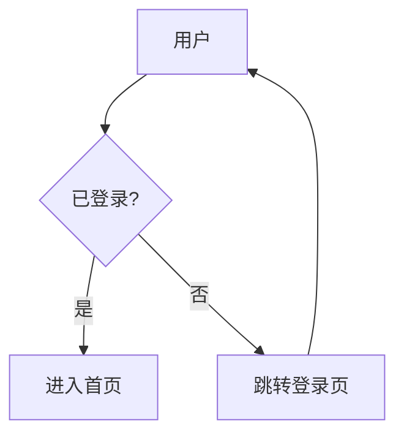

# anymermaid

<p align="center">
  <a href="README.md">English</a> | <a href="README_zh.md">简体中文</a>
</p>

**面向 AI Agent 的 Mermaid 画图技能包**——覆盖 26 种官方图表类型的完整语法参考、跨平台命令模板，以及 puppeteer 沙箱、headless 环境处理、stdin 直渲、干跑校验等实战经验。

适用于 Claude Code、OpenCode、Cursor 等支持 SKILL.md 规范的 AI Agent 环境；也可作为纯粹的 Mermaid 语法/`mmdc` 命令速查手册直接阅读。

---

## 特性

- ✅ **26 种图表类型全覆盖**——从流程图、时序图这类常用图，到 C4、桑基、雷达、Wardley、事件建模等专业图，都提供了可复制即用的最小示例
- ✅ **跨平台命令**——macOS / Linux / Windows PowerShell / cmd 全部提供对应写法，不再有"Windows 用户看到 heredoc 抓瞎"的情况
- ✅ **修正多处语法坑**——时序图 8 种箭头列全、类图/ER 关系表用代码块避免 markdown 渲染破坏、思维导图 root 语法说清楚
- ✅ **Headless 自动降级**——SSH / CI / Docker 环境自动跳过"打开图片"这步，仅打印绝对路径
- ✅ **推荐参数固化**——所有渲染命令内置 `-w 1600 -s 3`，避免默认输出模糊或布局压缩
- ✅ **实战排错表**——含 Puppeteer 沙箱、字体缺失、PowerShell 执行策略、PATH 未刷新等 10+ 常见问题一键定位

---

## 快速开始

### 前置条件

需要 Node.js ≥ 18 与 Mermaid CLI：

```bash
# 三平台通用
npm install -g @mermaid-js/mermaid-cli
```

免安装单次运行（每次会临时下载）：

```bash
npx  -p @mermaid-js/mermaid-cli mmdc -i diagram.mmd -o diagram.svg
pnpm dlx @mermaid-js/mermaid-cli mmdc -i diagram.mmd -o diagram.svg
bunx @mermaid-js/mermaid-cli mmdc -i diagram.mmd -o diagram.svg
```

### 作为 AI Agent 技能使用

把 `anymermaid-skill` 整个目录放入你 Agent 的技能加载路径，重启 Agent，然后直接对它说：

> 画一个用户登录的时序图

Agent 会自动匹配到本技能、按 `SKILL.md` 的工作流程识别图表类型、查阅 `anymermaid-skill/references/syntax.md` 对应章节、写 `.mmd` 文件、调用 `mmdc` 渲染，并把绝对路径返回给你。

### 作为语法速查手册使用

不需要 AI Agent 也可以直接阅读：

- **命令 & 工作流**：见 [`SKILL.md`](./skills/anymermaid-skill/SKILL.md)
- **26 种图表完整语法**：见 [`references/syntax.md`](./skills/anymermaid-skill/references/syntax.md)

---

## 目录结构

```
anymermaid/
├── SKILL.md           # 主定义：工作流、命令、参数、排错
└── references/
    └── syntax.md      # 26 种图表语法参考（774 行）
```

---

## 覆盖的图表类型

| 常用图（12 种） | 专业图（14 种） |
|---|---|
| 流程图 `flowchart` | C4 图 `C4Context` 等 |
| 时序图 `sequenceDiagram` | 需求图 `requirementDiagram` |
| 类图 `classDiagram` | 桑基图 `sankey-beta` |
| 状态图 `stateDiagram-v2` | XY 图表 `xychart-beta` |
| ER 图 `erDiagram` | 块图 `block-beta` |
| 甘特图 `gantt` | 数据包图 `packet-beta` |
| 饼图 `pie` | 看板图 `kanban` |
| Git 图 `gitGraph` | 架构图 `architecture-beta` |
| 用户旅程图 `journey` | 雷达图 `radar-beta` |
| 思维导图 `mindmap` | 事件建模图 `eventmodeling` |
| 时间线图 `timeline` | 树状图 `treemap-beta` |
| 象限图 `quadrantChart` | 韦恩图 `venn-beta` |
|  | 石川图/鱼骨图 `ishikawa-beta` |
|  | Wardley 地图 `wardley-beta` |

其余更新中的图表（泳道图、ZenUML、Cynefin、树视图 等）请参阅 [Mermaid 官方文档](https://mermaid.nodejs.cn/)。

---

## 最小示例

创建 `hello.mmd`：



渲染（三平台命令一致）：

```bash
mmdc -i hello.mmd -o hello.svg -w 1600
```

Windows PowerShell / cmd 直接执行同一行即可，无需改写。

---

## 常见问题

**Q: 我在 Docker/CI 里跑报 "No usable sandbox"？**
A: 创建 `puppeteer-config.json`：`{"args": ["--no-sandbox", "--disable-setuid-sandbox"]}`，加参数 `-p puppeteer-config.json`。详见 `SKILL.md#puppeteer-沙箱配置`。

**Q: 中文字符渲染成方块？**
A: Docker/Linux CI 环境缺字体，`apt-get install -y fonts-wqy-zenhei` 即可。macOS/Windows 桌面无此问题。

**Q: Windows 装完 mmdc 命令找不到？**
A: 关闭当前终端重开，让 PATH 刷新；或直接用 `npx @mermaid-js/mermaid-cli mmdc ...`。

**Q: 图渲染出来布局压缩变形？**
A: 加 `-w 1600`。SVG 也需要这个参数——它决定初始布局宽度。

更多问题见 [`skills/anymermaid-skill/SKILL.md` 的排错章节](./skills/anymermaid-skill/SKILL.md#排错)。

---

## 贡献

欢迎 Issue 与 PR：

- 发现语法示例有误、mmdc 新版行为变化
- 补充新图表类型（尤其是 Mermaid 上游新增的 beta 图）
- 改进排错条目、跨平台命令
- 中文表述优化

---

## 相关链接

- Mermaid 官方文档：<https://mermaid.nodejs.cn/>
- Mermaid CLI（mmdc）仓库：<https://github.com/mermaid-js/mermaid-cli>
- 在线实时预览（Live Editor）：<https://mermaid.live/>
- 配置项完整 Schema：<https://mermaid.nodejs.cn/config/schema-docs/config.html>
