# Mermaid 图表语法参考

各 Mermaid 图表类型的详细语法。仅阅读与你要创建的图表相关的章节，无需加载整个文件。

## 目录

- [流程图（`graph` / `flowchart`）](#流程图graph--flowchart)
- [时序图（`sequenceDiagram`）](#时序图sequencediagram)
- [类图（`classDiagram`）](#类图classdiagram)
- [状态图（`stateDiagram-v2`）](#状态图statediagram-v2)
- [ER 图（`erDiagram`）](#er-图erdiagram)
- [甘特图（`gantt`）](#甘特图gantt)
- [饼图（`pie`）](#饼图pie)
- [Git 图（`gitGraph`）](#git-图gitgraph)
- [用户旅程图（`journey`）](#用户旅程图journey)
- [思维导图（`mindmap`）](#思维导图mindmap)
- [时间线图（`timeline`）](#时间线图timeline)
- [象限图（`quadrantChart`）](#象限图quadrantchart)
- [C4 图（`C4Context` 等）](#c4-图c4context-等)
- [需求图（`requirementDiagram`）](#需求图requirementdiagram)
- [桑基图（`sankey-beta`）](#桑基图sankey-beta)
- [XY 图表（`xychart-beta`）](#xy-图表xychart-beta)
- [块图（`block-beta`）](#块图block-beta)
- [数据包图（`packet-beta`）](#数据包图packet-beta)
- [看板图（`kanban`）](#看板图kanban)
- [架构图（`architecture-beta`）](#架构图architecture-beta)
- [雷达图（`radar-beta`）](#雷达图radar-beta)
- [事件建模图（`eventmodeling`）](#事件建模图eventmodeling)
- [树状图（`treemap-beta`）](#树状图treemap-beta)
- [韦恩图（`venn-beta`）](#韦恩图venn-beta)
- [石川图 / 鱼骨图（`ishikawa-beta`）](#石川图--鱼骨图ishikawa-beta)
- [Wardley 地图（`wardley-beta`）](#wardley-地图wardley-beta)
- [查阅更多](#查阅更多)

---

## 流程图（`graph` / `flowchart`）

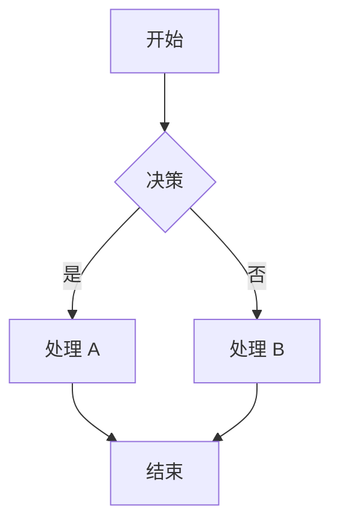
```mermaid
graph TD
    A[开始] --> B{决策}
    B -->|是| C[处理 A]
    B -->|否| D[处理 B]
    C --> E[结束]
    D --> E
```

### 方向

| 关键字 | 方向 |
|--------|------|
| `TD` / `TB` | 从上到下 |
| `LR` | 从左到右 |
| `BT` | 从下到上 |
| `RL` | 从右到左 |

### 节点形状

| 语法 | 形状 |
|------|------|
| `A[文本]` | 矩形 |
| `A(文本)` | 圆角矩形 |
| `A([文本])` | 体育场形 |
| `A[[文本]]` | 子程序 |
| `A[(文本)]` | 数据库圆柱 |
| `A{文本}` | 菱形（决策） |
| `A((文本))` | 圆形 |
| `A>文本]` | 不对称形 |

### 连线样式

| 语法 | 样式 |
|------|------|
| `-->` | 实线带箭头 |
| `---` | 实线无箭头 |
| `-.-` | 虚线无箭头 |
| `-.->` | 虚线带箭头 |
| `==>` | 粗线带箭头 |
| `===` | 粗线无箭头 |
| `-- 文本 -->` | 带标签的箭头 |
| `-->|文本|` | 标签的另一种写法 |

### 子图

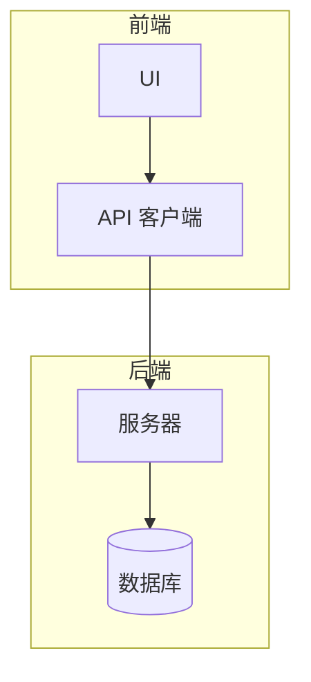
```mermaid
graph TB
    subgraph 前端
        A[UI] --> B[API 客户端]
    end
    subgraph 后端
        C[服务器] --> D[(数据库)]
    end
    B --> C
```

### 样式定制

```
classDef highlight fill:#f96,stroke:#333,stroke-width:2px;
class A highlight
linkStyle 1 stroke:#f00,stroke-width:2px;
```

---

## 时序图（`sequenceDiagram`）

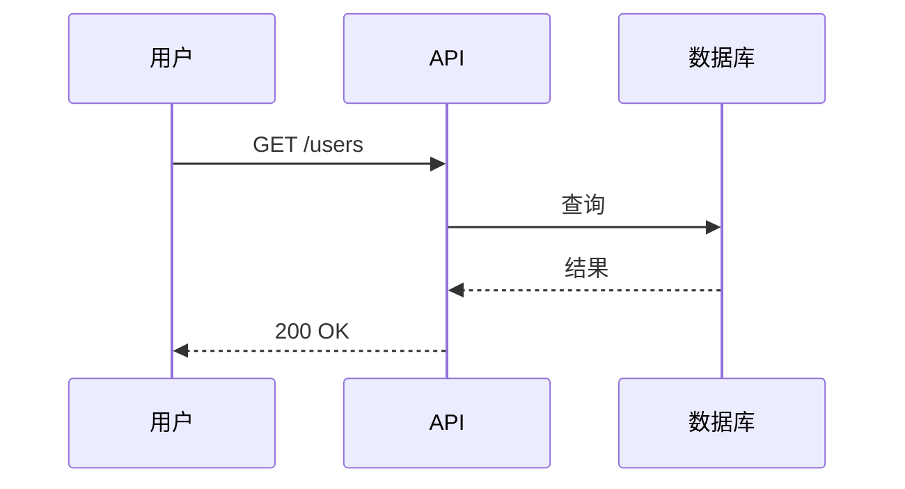
```mermaid
sequenceDiagram
    participant U as 用户
    participant A as API
    participant D as 数据库
    U->>A: GET /users
    A->>D: 查询
    D-->>A: 结果
    A-->>U: 200 OK
```

### 箭头类型

用代码块列出以避免 `|` 与 markdown 表格分隔符冲突：

```
->>     实线闭合箭头（同步调用）
-->>    虚线闭合箭头（同步响应）
->      实线开放箭头（无箭头头）
-->     虚线开放箭头
-)      异步实线开放箭头
--)     异步虚线开放箭头
-x      实线丢失箭头（消息丢失/失败，同步）
--x     虚线丢失箭头（消息丢失/失败，异步）
```

### 激活与生命线

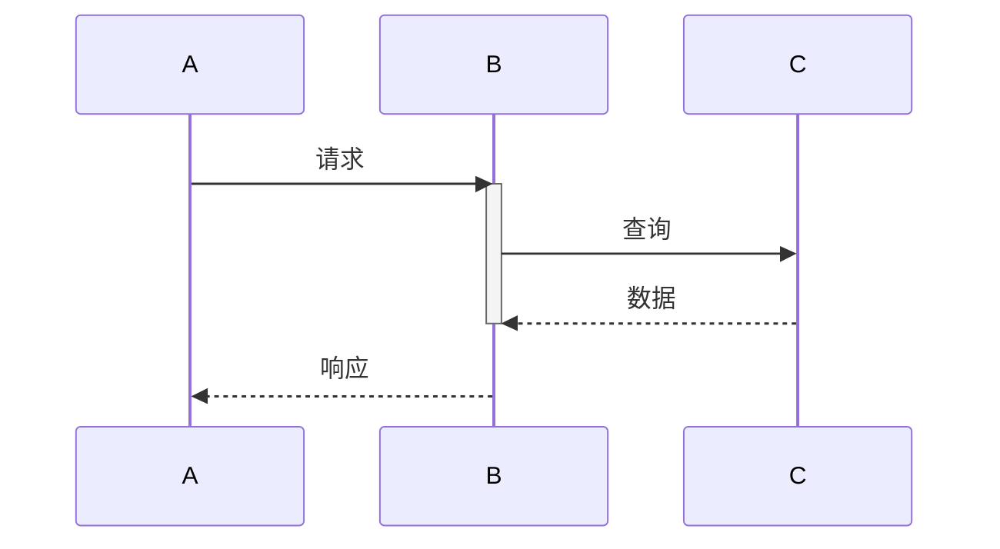
```mermaid
sequenceDiagram
    A->>B: 请求
    activate B
    B->>C: 查询
    C-->>B: 数据
    deactivate B
    B-->>A: 响应
```

简写：`A->>+B: ...`（`+` 自动激活）`B-->>-A: ...`（`-` 自动取消激活）。

### 循环、alt、opt

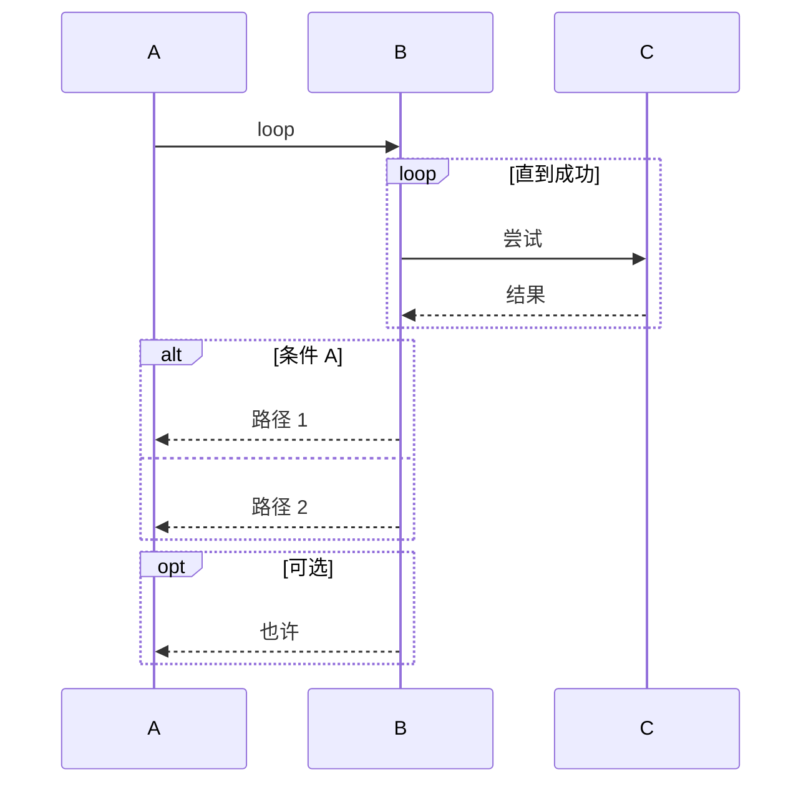
```mermaid
sequenceDiagram
    A->>B: loop
    loop 直到成功
        B->>C: 尝试
        C-->>B: 结果
    end
    alt 条件 A
        B-->>A: 路径 1
    else
        B-->>A: 路径 2
    end
    opt 可选
        B-->>A: 也许
    end
```

### 备注

```
Note over A,B: 共享备注
Note right of A: 针对 A 的备注
```

---

## 类图（`classDiagram`）

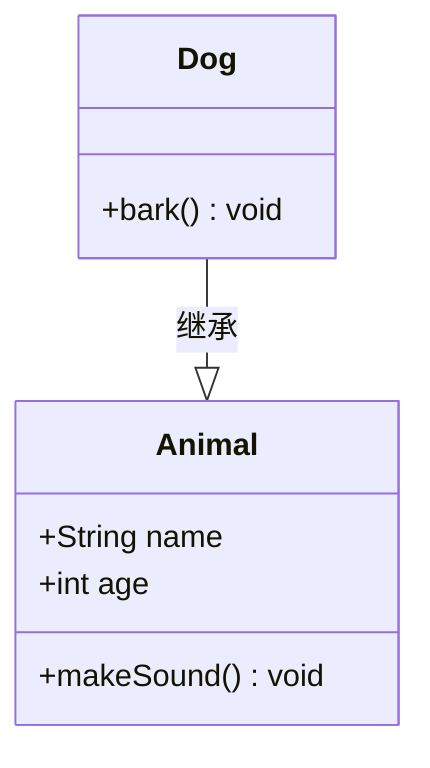
```mermaid
classDiagram
    class Animal {
        +String name
        +int age
        +makeSound() void
    }
    class Dog {
        +bark() void
    }
    Dog --|> Animal : 继承
```

### 可见性

| 符号 | 可见性 |
|------|--------|
| `+` | 公有 |
| `-` | 私有 |
| `#` | 受保护 |
| `~` | 包级 |

### 关系

用代码块列出（`|` 在 markdown 表格中是分隔符，此处避免误解析）：

```
--|>     继承（B 继承 A：B --|> A）
..|>     实现 / implements（虚线三角）
-->      关联（有方向）
--       关联（无方向）
..>      依赖（虚线箭头）
*--      组合（composition，实心菱形在拥有方）
o--      聚合（aggregation，空心菱形在拥有方）
--       附加 ": 标签"：可命名关联
```

方向可反向：`<|--`、`<--`、`<*--`、`<o--` 等。示例：

```
Animal <|-- Dog          %% Animal 是父类
Car *-- Engine           %% Car 组合 Engine
Order o-- LineItem       %% Order 聚合 LineItem
```

### 泛型与构造型

```
class Shape~T~ {
    +T value
}
class Cache <<interface>> {
    +get(key) T
}
```

---

## 状态图（`stateDiagram-v2`）

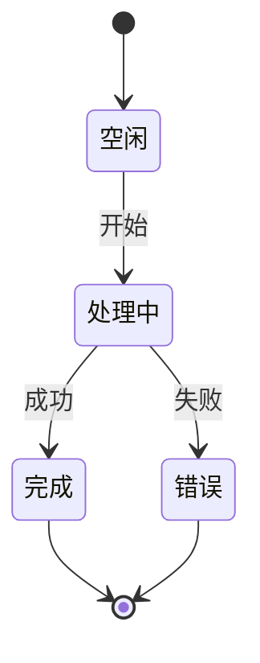
```mermaid
stateDiagram-v2
    [*] --> 空闲
    空闲 --> 处理中 : 开始
    处理中 --> 完成 : 成功
    处理中 --> 错误 : 失败
    完成 --> [*]
    错误 --> [*]
```

### 复合状态

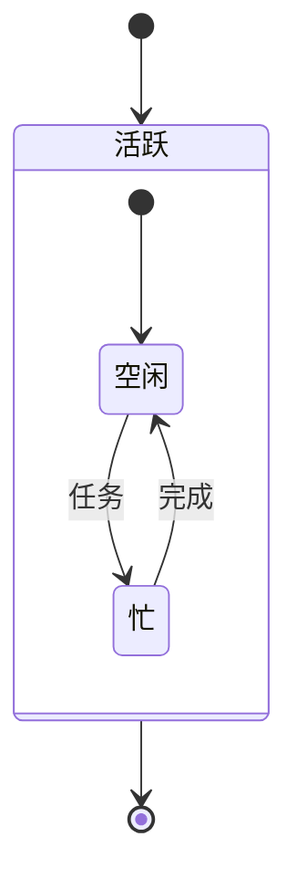
```mermaid
stateDiagram-v2
    [*] --> 活跃
    state 活跃 {
        [*] --> 空闲
        空闲 --> 忙 : 任务
        忙 --> 空闲 : 完成
    }
    活跃 --> [*]
```

### Fork / Join

```
state Fork_state <<fork>>
state Join_state <<join>>
[*] --> Fork_state
Fork_state --> State1
Fork_state --> State2
State1 --> Join_state
State2 --> Join_state
Join_state --> [*]
```

---

## ER 图（`erDiagram`）

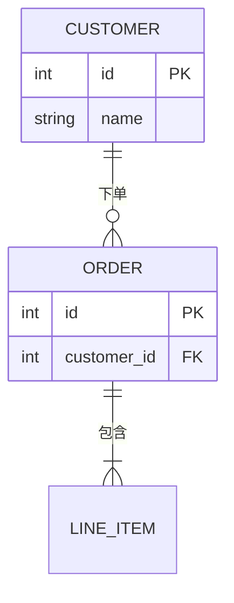
```mermaid
erDiagram
    CUSTOMER ||--o{ ORDER : 下单
    ORDER ||--|{ LINE_ITEM : 包含
    CUSTOMER {
        int id PK
        string name
    }
    ORDER {
        int id PK
        int customer_id FK
    }
```

### 基数

用代码块列出（`|` 在 markdown 表格中是分隔符，会破坏语法展示）：

```
||--||    恰好一个 - 恰好一个
|o--o|    零或一 - 零或一
}o--o{    多 - 多（多对多）
||--o{    恰好一 - 零或多（一对多）
||--|{    恰好一 - 一或多（一对多，且必至少一个）
}|--||    一或多 - 恰好一
```

格式：`<左侧基数>--<右侧基数>`。
- `||` 表示恰好一个
- `|o` 表示零或一个
- `|{` 表示一或多个
- `o{` 表示零或多个

### 属性

```
ENTITY {
    type name PK     %% PK = 主键
    type name FK     %% FK = 外键
    type name
}
```

---

## 甘特图（`gantt`）

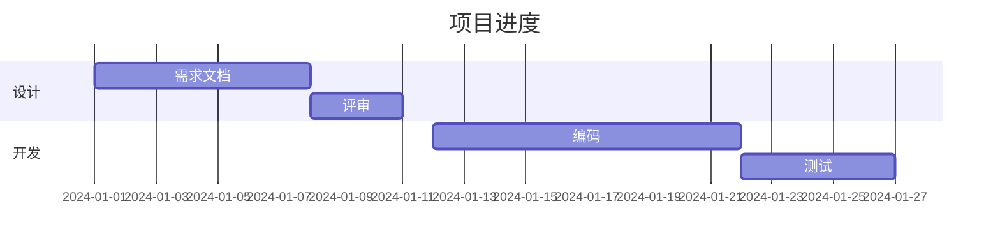
```mermaid
gantt
    title 项目进度
    dateFormat YYYY-MM-DD
    section 设计
        需求文档   :a1, 2024-01-01, 7d
        评审       :after a1, 3d
    section 开发
        编码       :2024-01-12, 10d
        测试       :2024-01-22, 5d
```

### 任务语法

```
<任务名> :<id>, <开始>, <时长>
<任务名> :<id>, after <其他 id>, <时长>
```

- `<开始>`：日期（需匹配 `dateFormat`）或 `after <id>`
- `<时长>`：如 `7d`、`2w`、`1h`
- 添加状态标志：`:a1, 2024-01-01, 7d, crit`（`crit` / `active` / `done` / `milestone`）

### 指令

| 指令 | 用途 |
|------|------|
| `dateFormat` | 输入日期格式（如 `YYYY-MM-DD`） |
| `axisFormat` | 轴上标签的显示格式 |
| `title` | 标题 |
| `section` | 分组 |
| `excludes` | 排除日期（如周末） |
| `todayMarker` | "今日"标记样式 |

---

## 饼图（`pie`）

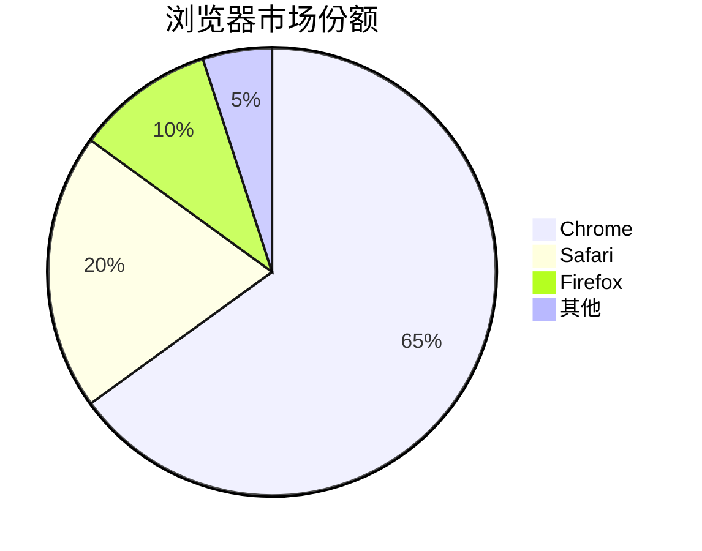
```mermaid
pie title 浏览器市场份额
    "Chrome" : 65
    "Safari" : 20
    "Firefox" : 10
    "其他"   : 5
```

无额外指令：`pie [title <文本>]` 后跟 `"标签" : <数值>` 行。

---

## Git 图（`gitGraph`）

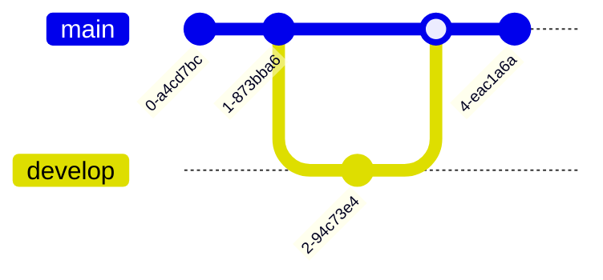
```mermaid
gitGraph
    commit
    commit
    branch develop
    checkout develop
    commit
    checkout main
    merge develop
    commit
```

> 提示：新版 Mermaid 支持 `switch <name>` 作为 `checkout <name>` 的别名（对齐现代 git 用法），两者当前均可用；未来版本可能仅保留 `switch`。

### 命令

| 命令 | 用途 |
|------|------|
| `commit` | 当前分支上提交 |
| `commit id: "msg"` | 带消息的提交 |
| `commit tag: "v1.0"` | 带 tag 的提交 |
| `branch <name>` | 创建分支 |
| `checkout <name>` / `switch <name>` | 切换分支 |
| `merge <name>` | 将某分支合并到当前分支 |
| `cherry-pick id: "xxx"` | 摘取某个提交 |

---

## 用户旅程图（`journey`）

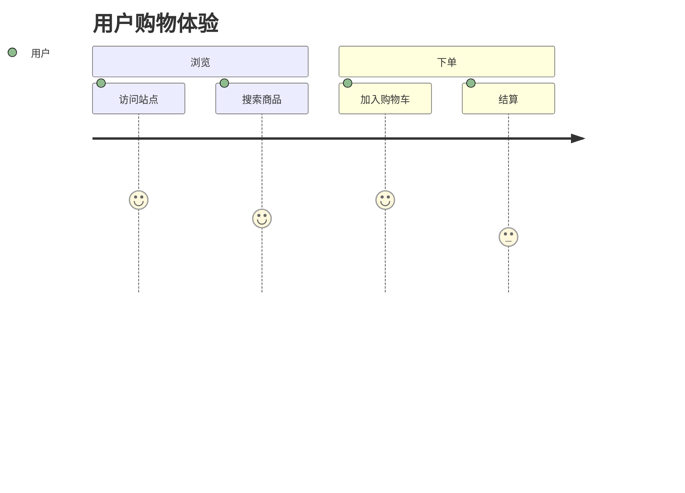
```mermaid
journey
    title 用户购物体验
    section 浏览
        访问站点: 5: 用户
        搜索商品: 4: 用户
    section 下单
        加入购物车: 5: 用户
        结算: 3: 用户
```

语法：`<任务名> : <满意度 1-5> : <参与者>`。`section` 用于分组。

---

## 思维导图（`mindmap`）

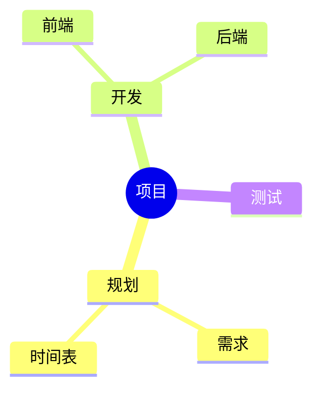
```mermaid
mindmap
  root((项目))
    规划
      需求
      时间表
    开发
      前端
      后端
    测试
```

### 节点形状（缩进表示层级）

```
  root((圆形 root))    %% 根节点必须以 root 开头；此处 (( )) 让 root 显示为圆形
    (圆角矩形)
    [矩形]
    {{六边形}}
    ((圆形子节点))     %% 子节点也可用圆形；根节点必须命名为 root
```

要点：
- 每个 mindmap 有且只有一个根节点，必须以 `root` 开头
- `root((...))`、`root[...]`、`root(...)` 都合法，形状不同
- 缩进层级决定父子关系

---

## 时间线图（`timeline`）

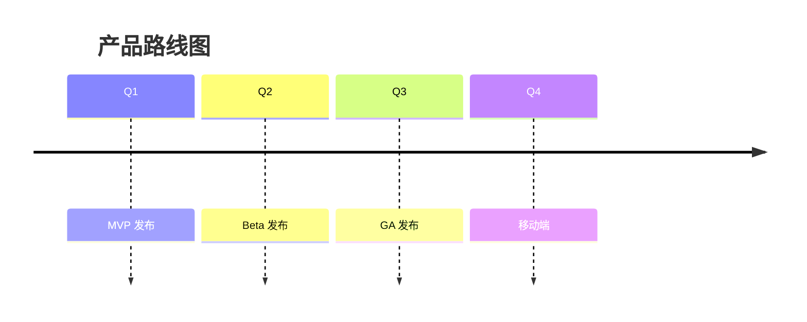
```mermaid
timeline
    title 产品路线图
    Q1 : MVP 发布
    Q2 : Beta 发布
    Q3 : GA 发布
    Q4 : 移动端
```

同一时间点多个事件：

```
    2024-01 : 设计完成
            : 规格冻结
    2024-02 : 开始编码
```

---

## 象限图（`quadrantChart`）

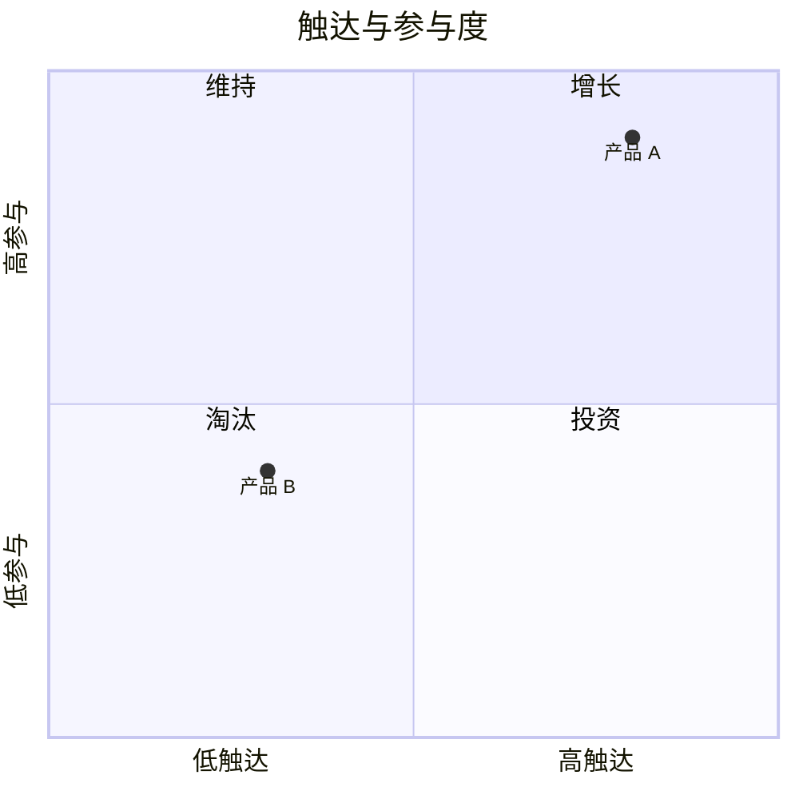
```mermaid
quadrantChart
    title 触达与参与度
    x-axis 低触达 --> 高触达
    y-axis 低参与 --> 高参与
    quadrant-1 增长
    quadrant-2 维持
    quadrant-3 淘汰
    quadrant-4 投资
    产品 A: [0.8, 0.9]
    产品 B: [0.3, 0.4]
```

数据点用 `[x, y]` 给出，坐标范围为 0–1。

---

## C4 图（`C4Context` 等）

C4 模型的软件架构图，描述系统上下文、容器、组件与部署视角。变体：`C4Context` / `C4Container` / `C4Component` / `C4Dynamic` / `C4Deployment`。

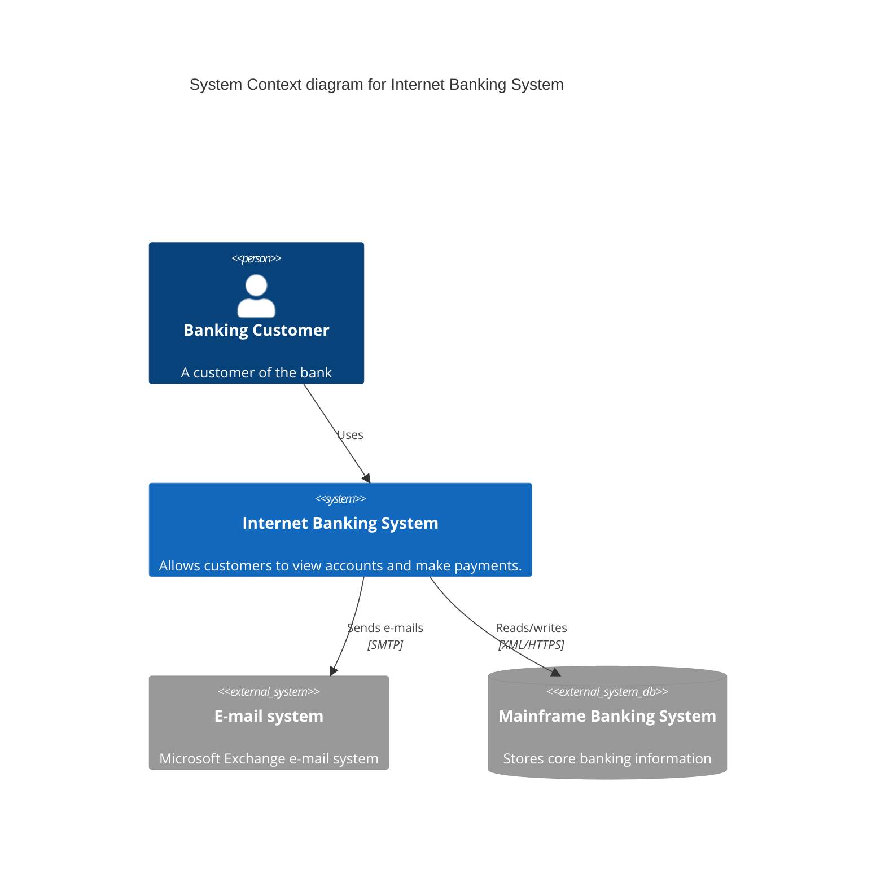
```mermaid
C4Context
    title System Context diagram for Internet Banking System
    Person(customerA, "Banking Customer", "A customer of the bank")
    System(SystemAA, "Internet Banking System", "Allows customers to view accounts and make payments.")
    System_Ext(SystemC, "E-mail system", "Microsoft Exchange e-mail system")
    SystemDb_Ext(SystemE, "Mainframe Banking System", "Stores core banking information")

    Rel(customerA, SystemAA, "Uses")
    Rel(SystemAA, SystemC, "Sends e-mails", "SMTP")
    Rel(SystemAA, SystemE, "Reads/writes", "XML/HTTPS")
```

---

## 需求图（`requirementDiagram`）

描述需求、需求间关系（`contains` / `derives` / `satisfies` / `verifies` / `refines` / `traces`）以及实现元素。

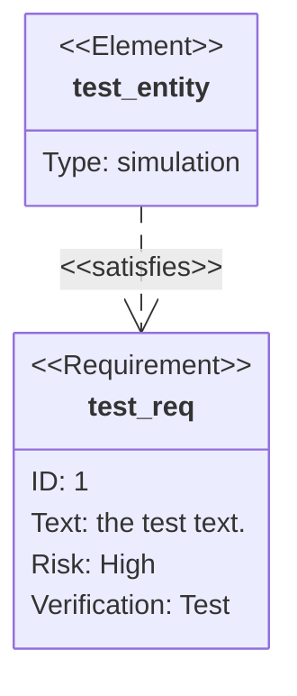
```mermaid
requirementDiagram
    requirement test_req {
        id: 1
        text: the test text.
        risk: high
        verifymethod: test
    }
    element test_entity {
        type: simulation
    }
    test_entity - satisfies -> test_req
```

---

## 桑基图（`sankey-beta`）

用条带宽度表示流量/数量的流向图，直接用 CSV 数据。

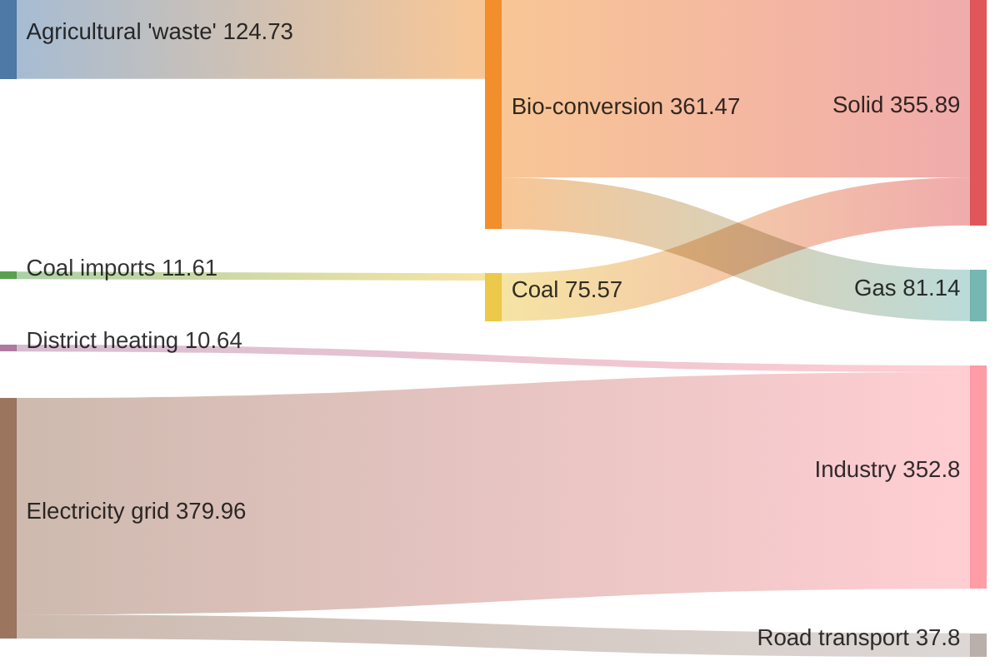
```mermaid
sankey-beta
Agricultural 'waste',Bio-conversion,124.729
Bio-conversion,Solid,280.322
Bio-conversion,Gas,81.144
Coal imports,Coal,11.606
Coal,Solid,75.571
District heating,Industry,10.639
Electricity grid,Industry,342.165
Electricity grid,Road transport,37.797
```

---

## XY 图表（`xychart-beta`）

柱状图与折线图，可叠加。

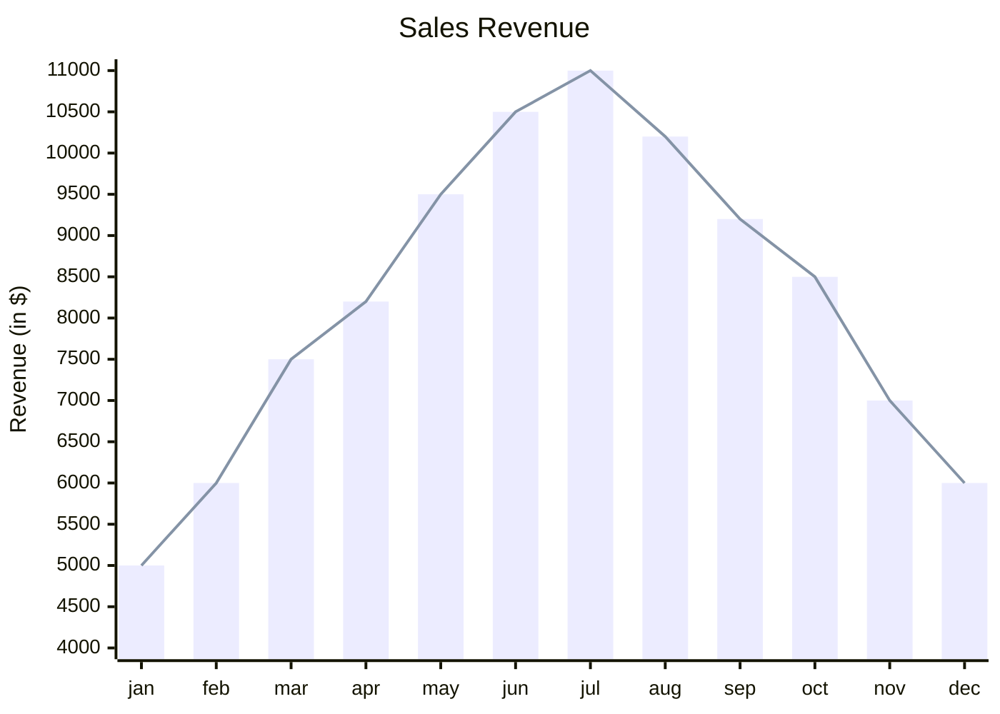
```mermaid
xychart-beta
    title "Sales Revenue"
    x-axis [jan, feb, mar, apr, may, jun, jul, aug, sep, oct, nov, dec]
    y-axis "Revenue (in $)" 4000 --> 11000
    bar  [5000, 6000, 7500, 8200, 9500, 10500, 11000, 10200, 9200, 8500, 7000, 6000]
    line [5000, 6000, 7500, 8200, 9500, 10500, 11000, 10200, 9200, 8500, 7000, 6000]
```

---

## 块图（`block-beta`）

基于块的架构图，可分列、嵌套、加箭头。

```mermaid
block-beta
    columns 1
    db(("DB"))
    blockArrowId6<["&nbsp;&nbsp;&nbsp;"]>(down)
    block:ID
        A
        B["A wide one in the middle"]
        C
    end
    space
    D
    ID --> D
    C --> D
    style B fill:#969,stroke:#333,stroke-width:4px
```

---

## 数据包图（`packet-beta`）

网络协议数据包结构，用比特范围标注字段。

```mermaid
---
title: "TCP Packet"
---
packet-beta
    0-15: "Source Port"
    16-31: "Destination Port"
    32-63: "Sequence Number"
    64-95: "Acknowledgment Number"
    96-99: "Data Offset"
    100-105: "Reserved"
    106: "URG"
    107: "ACK"
    108: "PSH"
    109: "RST"
    110: "SYN"
    111: "FIN"
    112-127: "Window"
    128-143: "Checksum"
    144-159: "Urgent Pointer"
    160-191: "(Options and Padding)"
    192-255: "Data (variable length)"
```

---

## 看板图（`kanban`）

任务看板，列 + 卡片；卡片可加元数据（`assigned`、`ticket`、`priority`）。

```mermaid
kanban
    Todo
        [Design landing page]
        [Fix login bug]@{ assigned: 'alice', priority: 'high' }
    In Progress
        [Refactor auth module]@{ ticket: 'AUTH-42' }
    Done
        [Setup CI pipeline]
```

---

## 架构图（`architecture-beta`）

系统架构（云服务、数据库、磁盘等），支持分组和方向连接（`L/R/T/B`）。

```mermaid
architecture-beta
    group api(cloud)[API]

    service db(database)[Database] in api
    service disk1(disk)[Storage] in api
    service disk2(disk)[Storage] in api
    service server(server)[Server] in api

    db:L -- R:server
    disk1:T -- B:server
    disk2:T -- B:db
```

---

## 雷达图（`radar-beta`）

多维度对比图，一个 curve 一条闭合折线。

```mermaid
---
title: "Grades"
---
radar-beta
    axis m["Math"], s["Science"], e["English"]
    axis h["History"], g["Geography"], a["Art"]
    curve a["Alice"]{85, 90, 80, 70, 75, 90}
    curve b["Bob"]{70, 75, 85, 80, 90, 85}
    max 100
    min 0
```

---

## 事件建模图（`eventmodeling`）

事件驱动设计。`tf` 表示 timeline frame；`ui` / `cmd` / `evt` 分别为界面、命令、事件。

```mermaid
eventmodeling
    tf 01 ui CartUI
    tf 02 cmd AddItem   { description: string }
    tf 03 evt ItemAdded { description: string }
```

---

## 树状图（`treemap-beta`）

层级矩形数据，展示占比。

```mermaid
treemap-beta
"Category A"
    "Item A1": 10
    "Item A2": 20
"Category B"
    "Item B1": 15
    "Item B2": 25
```

---

## 韦恩图（`venn-beta`）

集合交集，用 `set` 定义集合、`union` 定义交集区域。

```mermaid
venn-beta
    title "Team overlap"
    set Frontend
    set Backend
    union Frontend,Backend["APIs"]
```

---

## 石川图 / 鱼骨图（`ishikawa-beta`）

根因分析，问题→大类→细因的层级缩进。

```mermaid
ishikawa-beta
    Blurry Photo
    Process
        Out of focus
        Shutter speed too slow
    User
        Shaky hands
    Equipment
        LENS
            Inappropriate lens
            Dirty lens
        SENSOR
            Damaged sensor
    Environment
        Subject moved too quickly
        Too dark
```

---

## Wardley 地图（`wardley-beta`）

战略映射，横轴演化阶段、纵轴价值链。`[x, y]` 是坐标，`evolve` 表示预期演化位置。

```mermaid
wardley-beta
    title Tea Shop Value Chain
    size [1100, 600]

    anchor Business [0.95, 0.63]
    component Cup of Tea [0.79, 0.61]
    component Tea        [0.63, 0.81]
    component Hot Water  [0.52, 0.80]
    component Kettle     [0.43, 0.35]
    component Power      [0.10, 0.70]

    Business -> Cup of Tea
    Cup of Tea -> Tea
    Cup of Tea -> Hot Water
    Hot Water -> Kettle
    Kettle -> Power

    evolve Kettle 0.62
    evolve Power  0.89

    note "Standardising power allows Kettles to evolve faster" [0.30, 0.49]
```

---

## 查阅更多

更多图表类型（泳道图、ZenUML、Cynefin 框架、树视图 等）与完整语法：<https://mermaid.nodejs.cn/>
